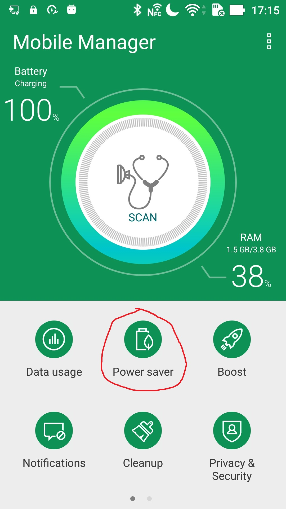

# Vendor specific power optimization settings

- [Asus](#asus)
- [Huawei/Honor](#huawei)
- [Oppo](#oppo)
- [Samsung](#samsung)
- [Xiaomi](#xiaomi)

### Asus
#### Auto-start
Allow auto-start for the app to make it run in the background correctly.

#### Asus mobile manager
You can set power saver in the Mobile Manager app. To make the app work properly, use Normal power saver mode.

### Huawei/Honor
#### App launch
Disable Manage all automatically for the app and then enable all application launch options.

#### Lock screen cleanup
Disable Close after screen is locked for the app.

### Oppo
#### Power Saver
Deny power saving including Smart power saver. Allow background running for the app in the Custom power saver section.

#### Startup Manager
Allow background running for the app in the Startup manager section.

### Samsung
#### Samsung battery
Make sure that the power saving mode is disabled and add the app to the unmonitored applications.

### Xiaomi
#### Autostart
Allow autostart for the app to make it run in the background correctly.

#### App battery saver
In the App Battery Saver section, select the app, click Save power and set No restrictions.

